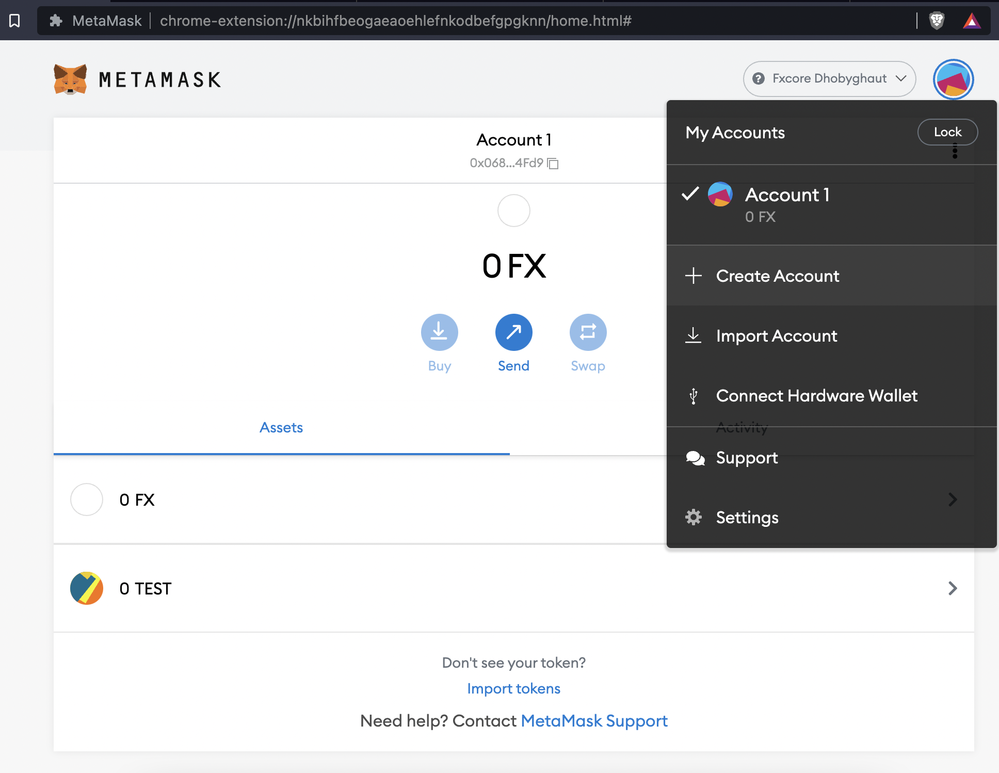
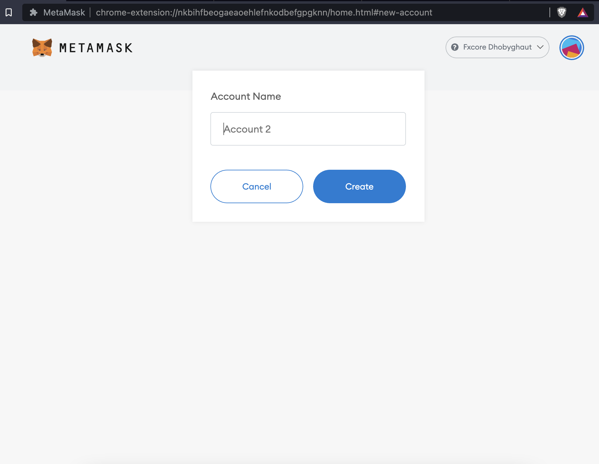
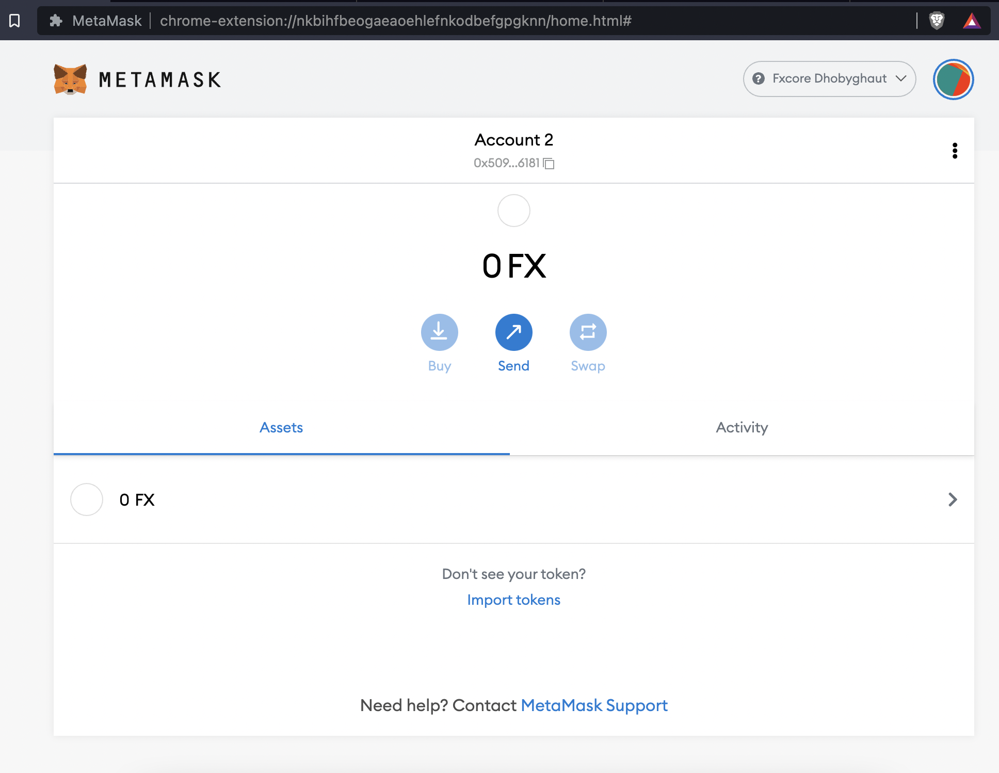
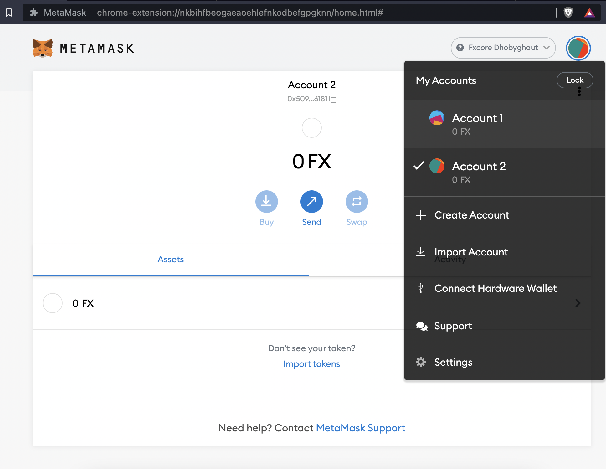
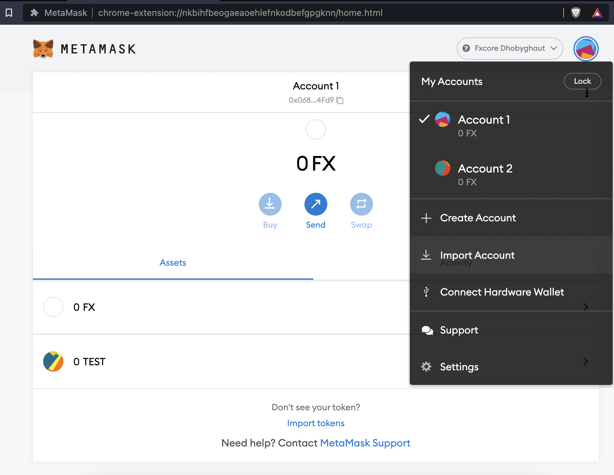
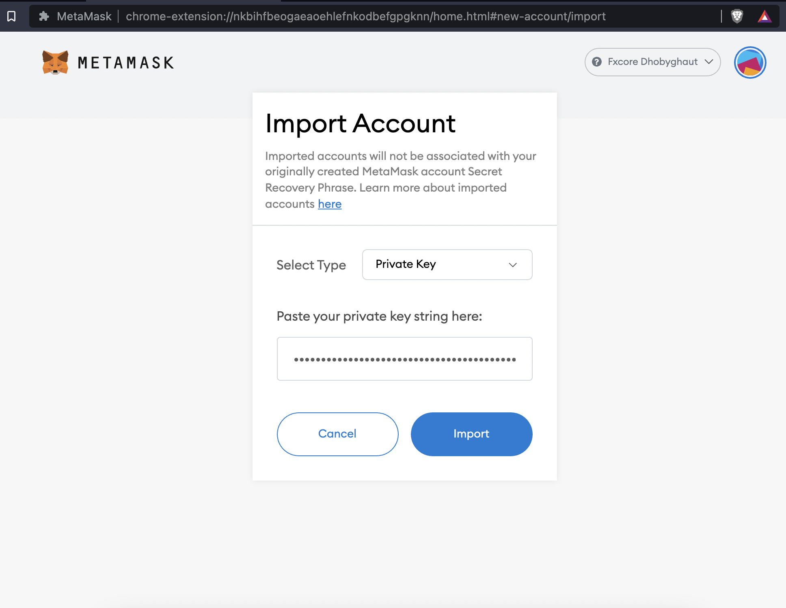
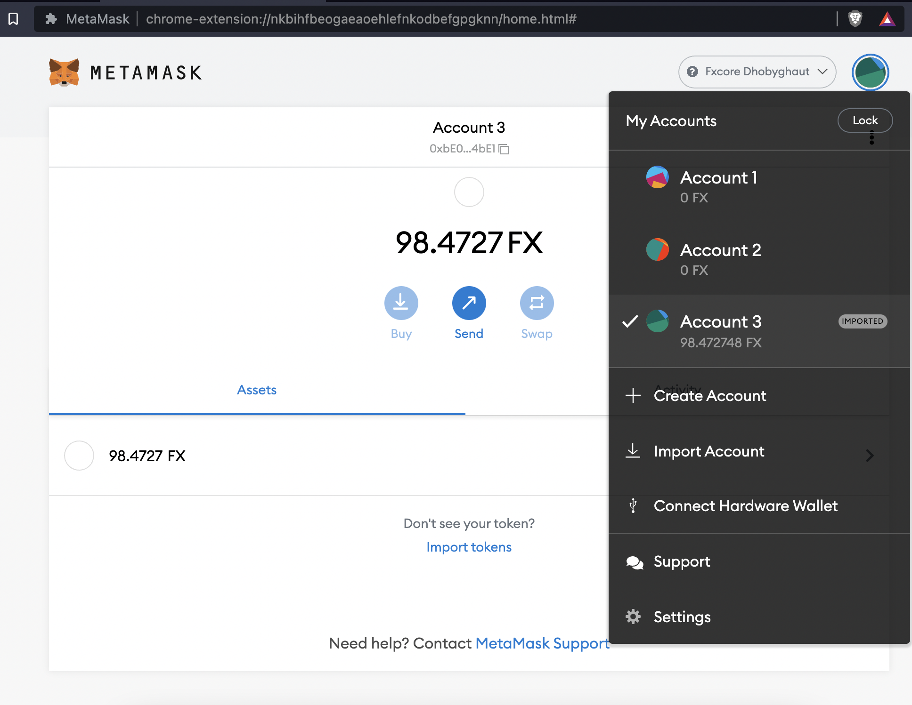

# Create and Import Accounts

### Create Multiple Accounts

Once you have an account on MetaMask, either via importing a wallet using the secret recovery phrase or via creating a new wallet, you can create more accounts.

1. Click on the Profile icon on MetaMask and click on 'Create Account'
2. You can give your account a name, Click on 'Create'
3. You will be brought back to the home page with your new account as your active account


By using the 'Create Account', you are creating a new account using the same **Secret Recovery Phrase** that was initially used to set up MetaMask. This means you can recover all accounts created from the same **Secret Recovery Phrase**.


### Switching Accounts

To switch active accounts follow the following steps.

1. Click on the Profile icon and select the account you want to switch to

### Import Accounts

To import an existing account into your current wallet, to do so you will required the private key of the account you want to import.

1. Click on the Profile icon and select 'Import Account'
2. Paste the private key string of the account you want to import
3. Click 'Import'
4. Your account will be imported. When you open the Profile icon you will see the word 'IMPORTED' beside its name, this indicates the account was imported and not generated within this wallet


Do not disclose your private key to anyone. If someone obtains your private key, they are able to access your account and sign transactions with it.



Your **Secret Recovery Phrase** will not recover accounts added with a private key/json file.

Make sure your **Secret Recovery Phrase** and private key(s) are securely stored to recover all your accounts.


