# Download and Install MetaMask

### Install MetaMask on your browser

To create a new wallet with MetaMask you first need to install the extension. You can install MetaMask for Chrome, Firefox, Brave and Edge browsers.

In this tutorial we will be using Brave as an example, but the workflow is the same for all browsers.

1. Open [https://metamask.io/download.html](https://metamask.io/download.html) and click on 'Install MetaMask for Brave'
2. Click on the button 'Add to Brave'
3. A pop-up will appear, click on 'Add extension'
4. Once complete, you will be automatically brought to the 'Welcome to MetaMask' page that has a 'Get Started' button


Be extremely careful when using a search engine to access the MetaMask website. Ensure the link you click on is [https://metamask.io](https://metamask.io) and not anything else.


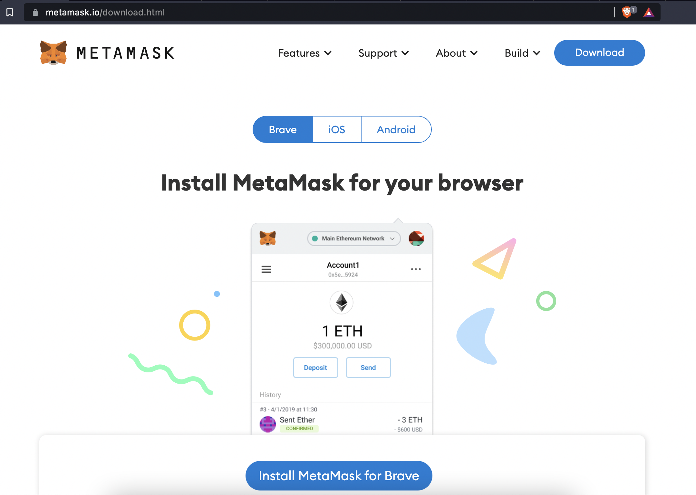

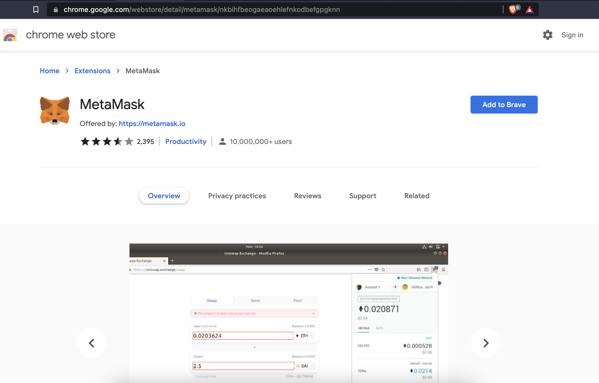

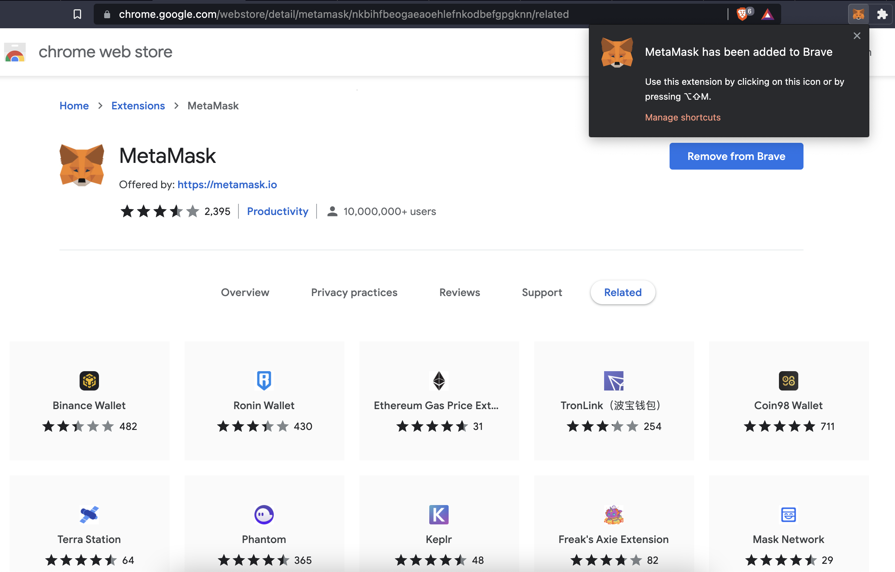

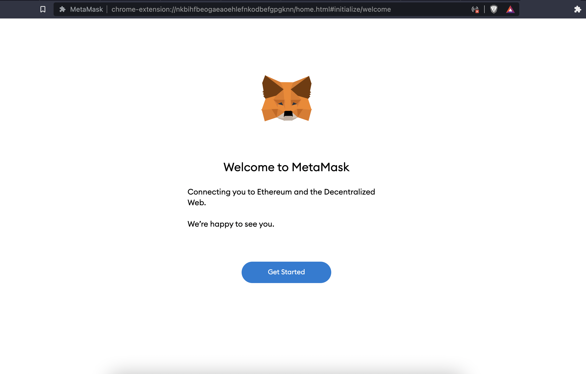

### Create an account

Once you click on 'Get Started', you will begin the process of creating an account using MetaMask. You will be given two options**;** for this section we will be creating a new wallet.

1. Click on 'Create a Wallet'
2. The next page is about data collection, it is up to you which choice to select
3. Input password and confirm password and agree to the Terms of Use (the password is required to unlock the wallet)
4. The next page will share information with you about the **Secret Recovery Phrase**, you are encourage to go through it before clicking on 'Next'
5. Click 'CLICK HERE TO REVEAL SECRET WORDS'
6. You will see a 12 words. Record the **Secret Recovery Phrase** in a secure location, eg. Write it down on a piece of paper and store in a secure location
7. Click on 'Next'
8. Verify your **Secret Recovery Phrase** by selecting the words in order. When done, click 'Confirm'
9. Congratulations! You have successfully created your MetaMask account. A new wallet address was automatically generated for you

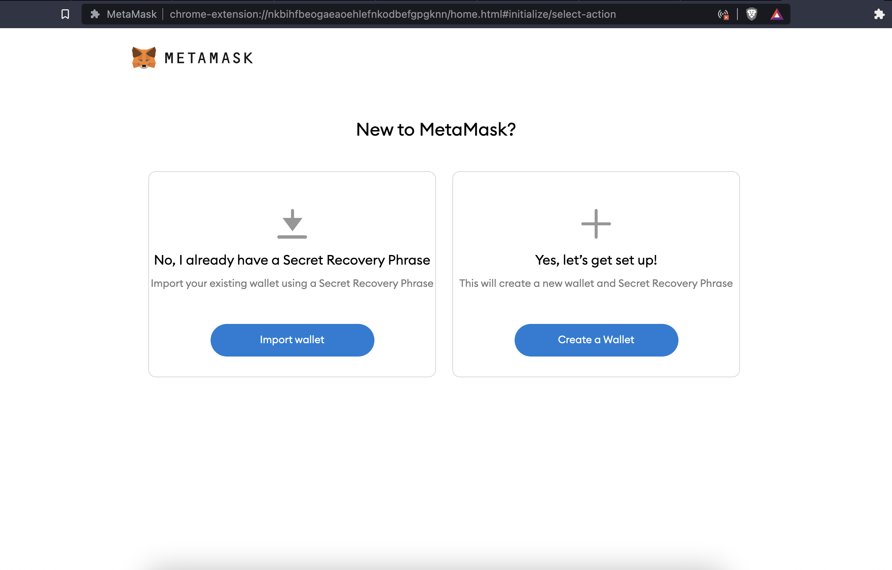

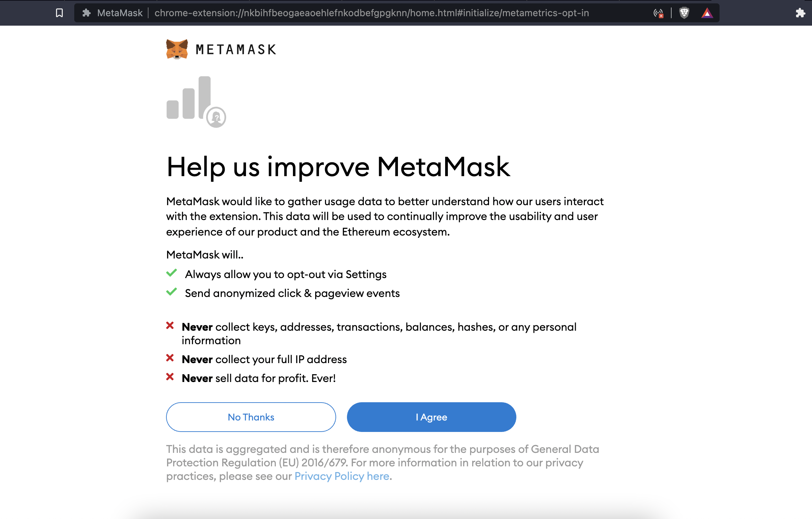

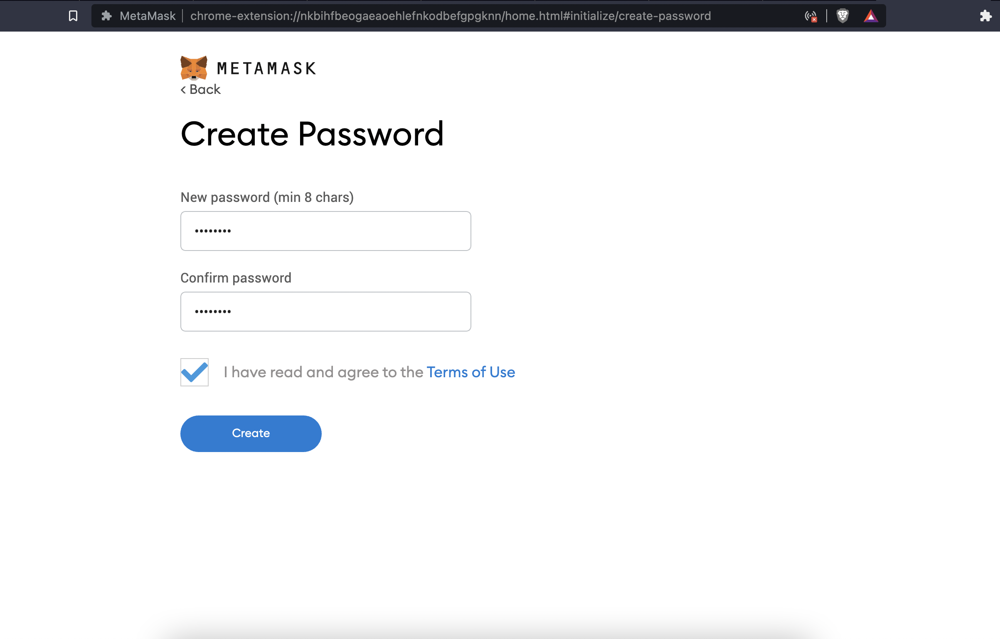

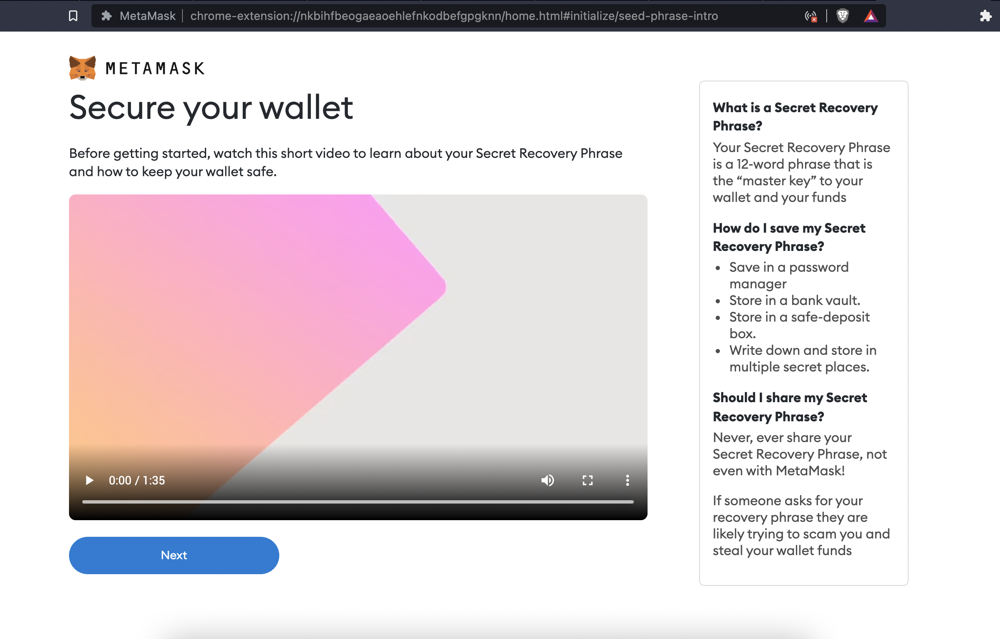

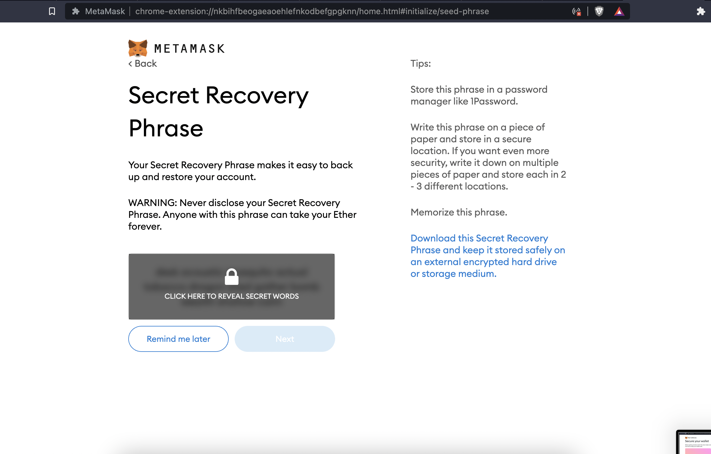

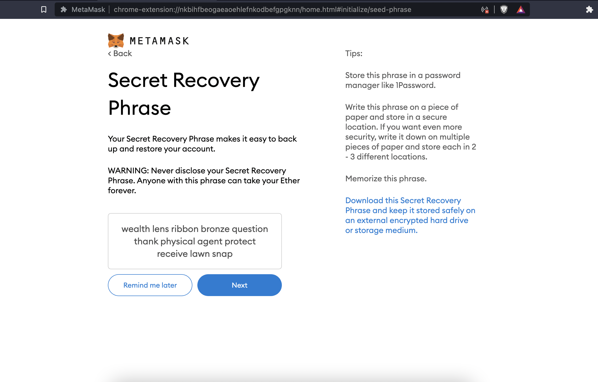


Write this phrase on a piece of paper and store it in a secure location. This phrase can be used to restore your account. Please backup your **Secret Recovery Phrase**, if your device breaks, is lost, stolen, or has data corruption, there is no other way to recover it. The **Secret Recovery Phrase** is the only way to recover your MetaMask accounts. Check more [Basic Safety and Security Tips for MetaMask](https://metamask.zendesk.com/hc/en-us/articles/360015489591-Basic-Safety-and-Security-Tips-for-MetaMask).


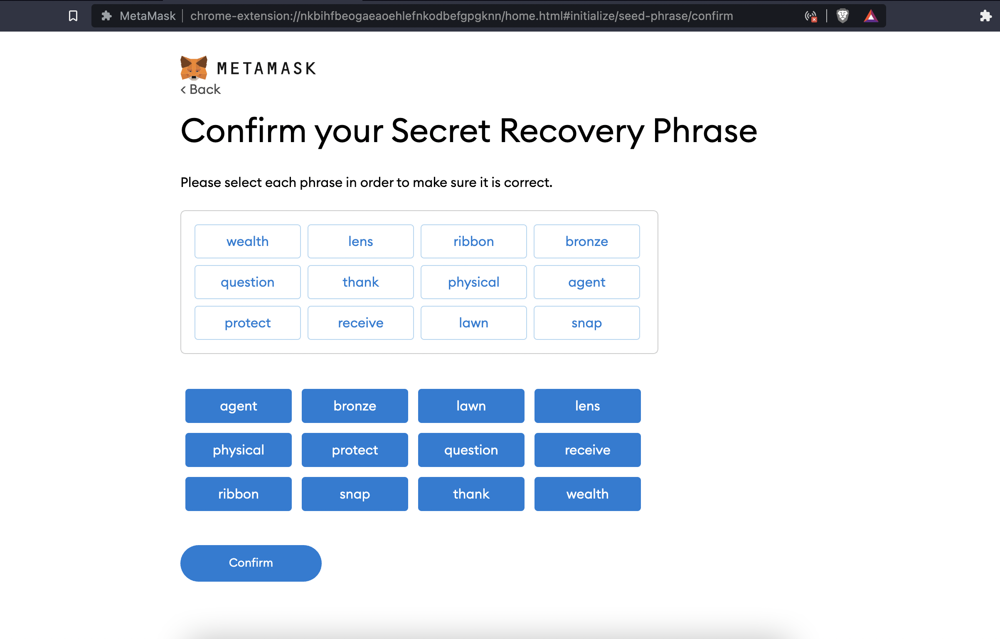

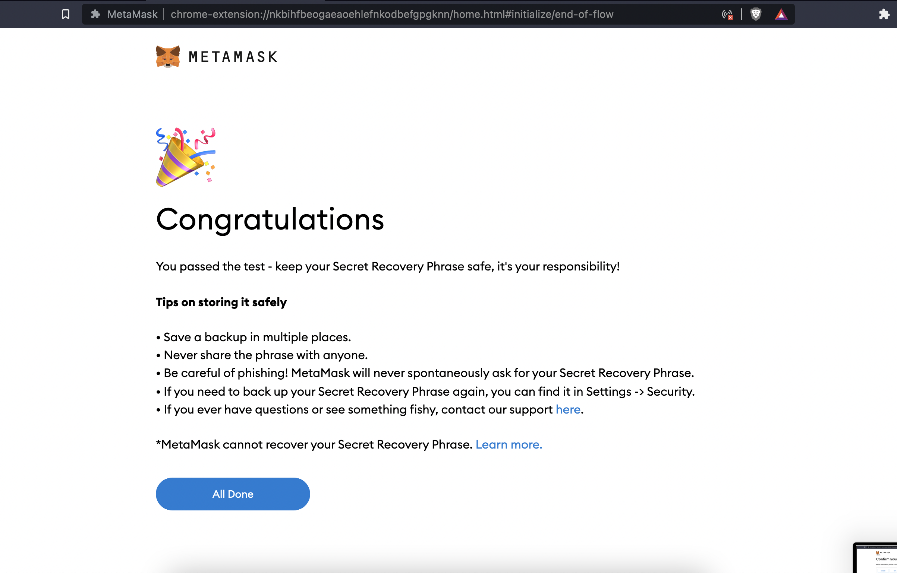

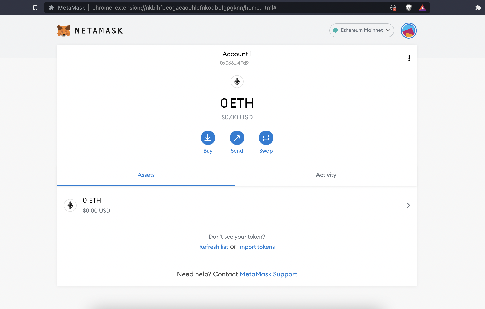

### Import Account using Secret Recovery Phrase (Mnemonic Phrase)

For this section we will be importing an existing account with a Secret Recovery Phrase that you have.&#x20;

1. Click on 'Import wallet'
2. The next page is about data collection, it is up to you which choice to select
3. Enter the Secret Recovery Phrase you have
4. Input password and confirm password and agree to the Terms of Use
5. Click 'Import'
6. Congratulations! You have successfully imported your account into MetaMask.

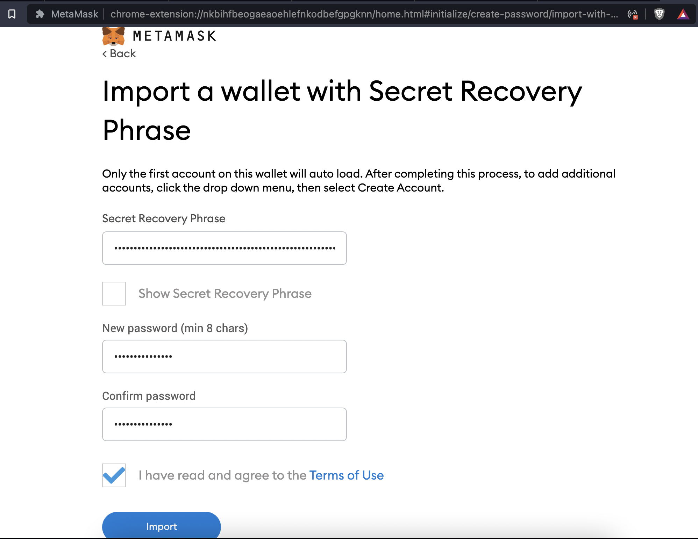
