# Connect using MetaMask

### Connect MetaMask Account to Dapp

So you have MetaMask now and you want to start using Dapps (if you do not already have MetaMask downloaded, please refer [here](../metamask/download-and-install-metamask.md)). In this tutorial we will be using a forked Uniswap on our Testnet as the Dapp we want to interact with, the process should be similar with any Dapp.


Only connect to websites that you trust. Always check that the URL is correct, and bookmark Dapps that you regularly visit/use.


1. Click on 'Connect Wallet' or 'Connect to a wallet'. Other Dapps will have similar buttons for the user to connect their wallet to start using the application.
2. Select 'MetaMask'
3. The MetaMask extension will prompt you to select which Account to connect to. Select the account you want to connect and click 'Next'
4. The MetaMask extension will take you to another page showing you what the site is requesting for, click 'Connect'.
5. It will show that MetaMask is connecting for a short moment and the extension will automatically close.
6. Now, you will see your address of the account at the top right hand corner instead of 'Connect to a wallet'
7. You can now start using the application! When you open the MetaMask extension, you will see on the top left that it is 'Connected'

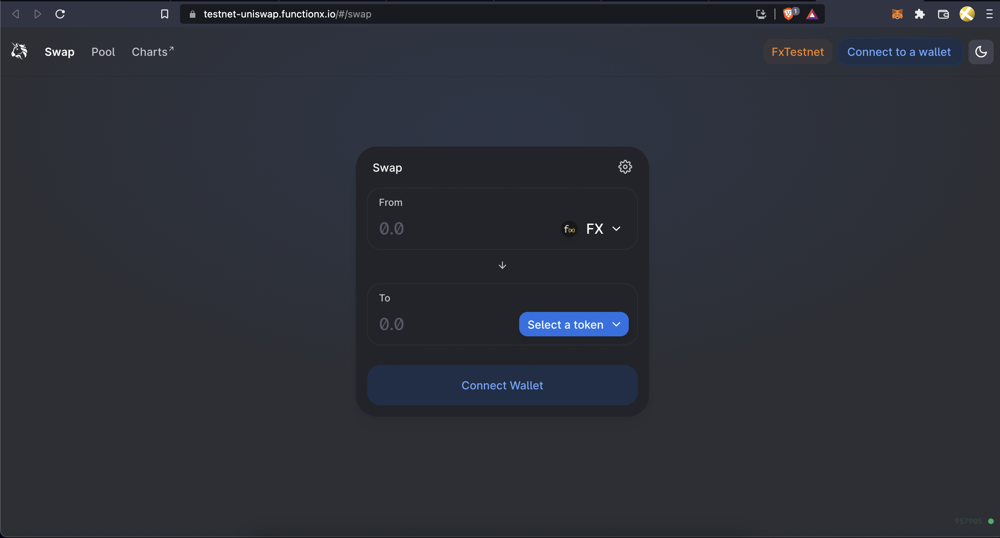

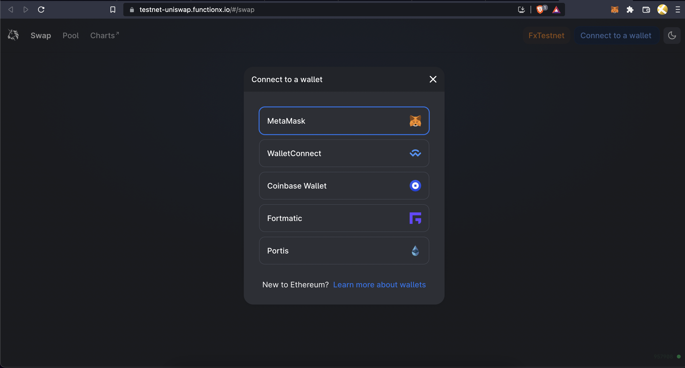

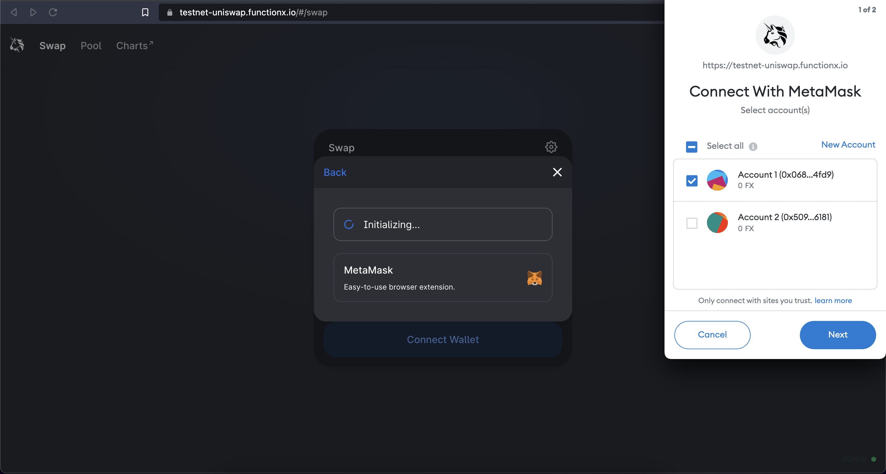

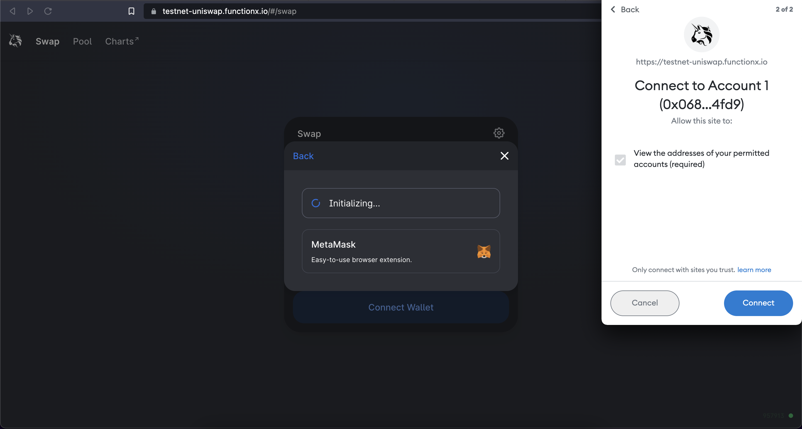

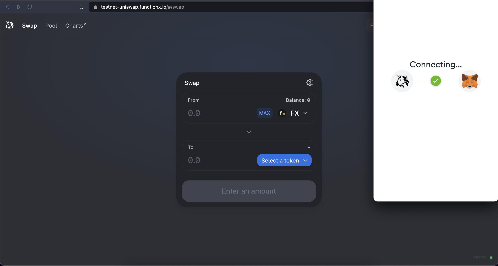

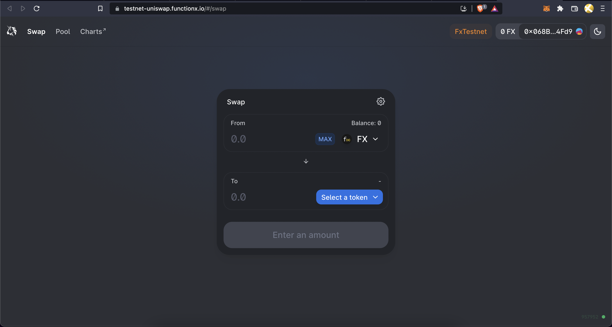

### View Connected Sites to Account

To view the a list of the sites that you have connected with your account.

1. Click on the 'three dots' menu icon near the top right corner of the MetaMask extension
2. Click on 'Connected sites'

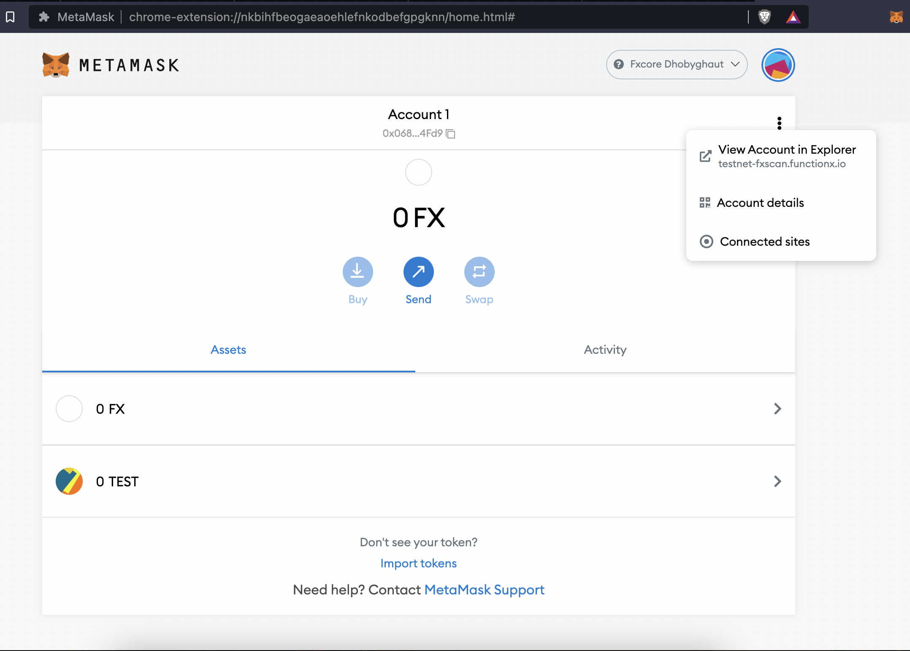

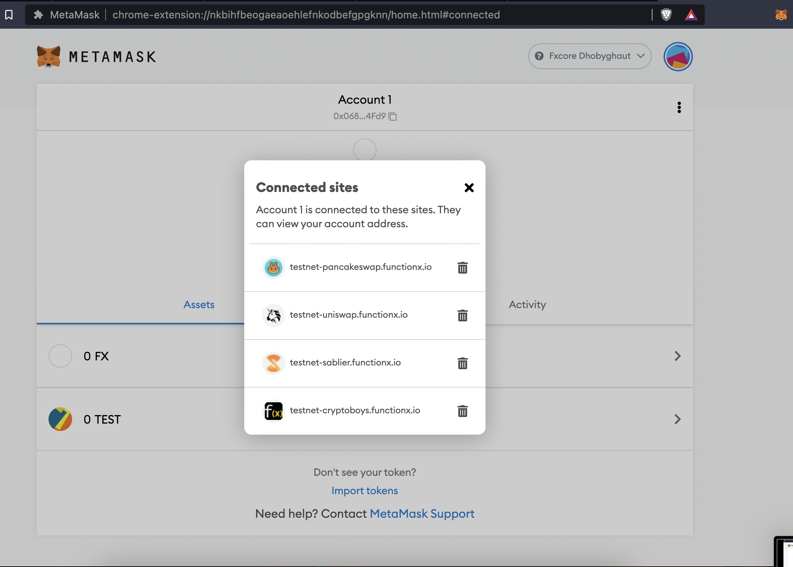

### Disconnect MetaMask from Dapp

By disconnecting MetaMask from the websites that you have connected to, the sites will no longer have the ability to read or access your wallet information. It is a good practice to have when you are no longer using the dapps.


Sometimes dapps have an option to disconnect your wallet. You are still strongly encouraged to disconnect via MetaMask


There are two ways to disconnect MetaMask from sites:

#### From 'Connected sites' List

Once you have navigated to the list of 'Connected sites', instructions can be found [above](connect-using-metamask.md#view-connected-sites-to-account).

1. Click on the 'trash bin' icon by the website url
2. Click on 'Disconnect'

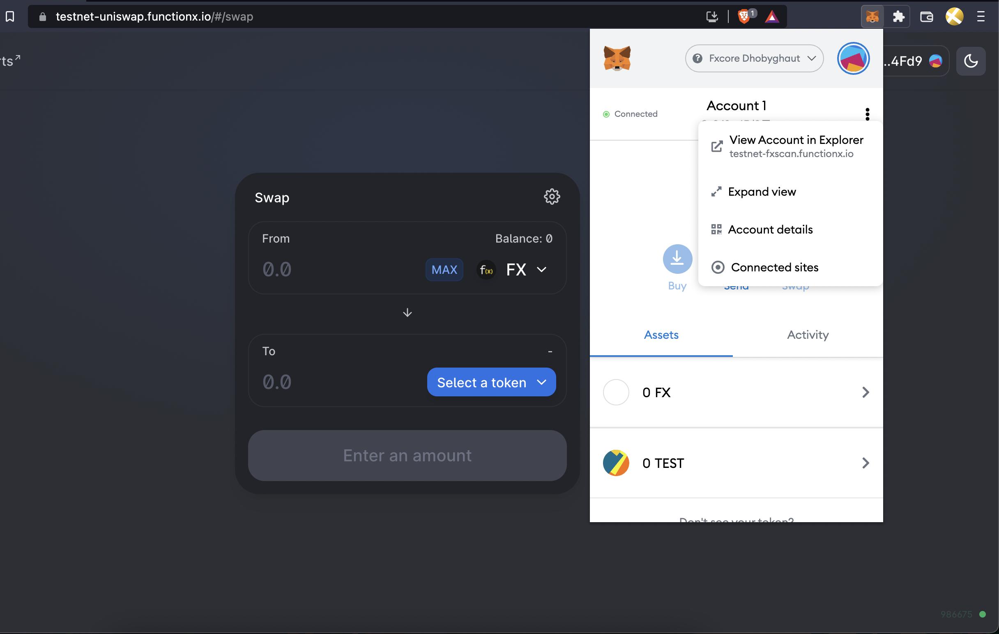

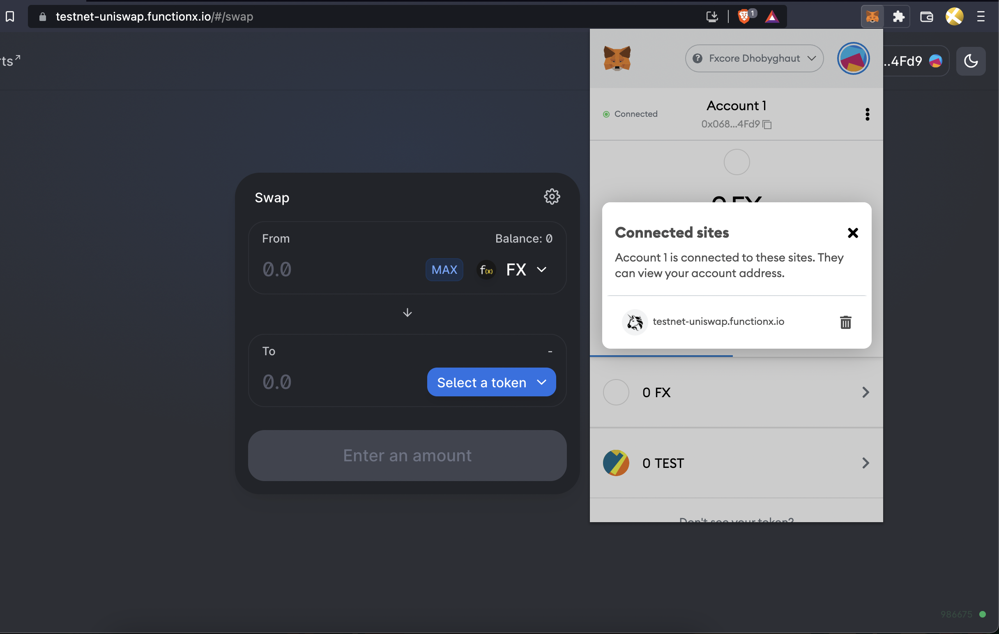

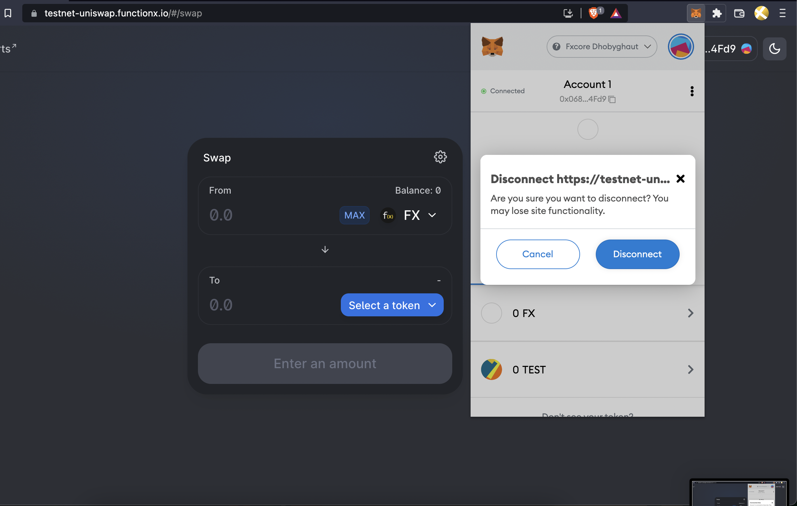

#### While on Website

While you are on the website and have already connected to it, open MetaMask and you will see 'Connected' near the top left corner.

1. Click on 'Connected'
2. Click on the 'three dots' icon&#x20;
3. Click on 'Disconnect this account'

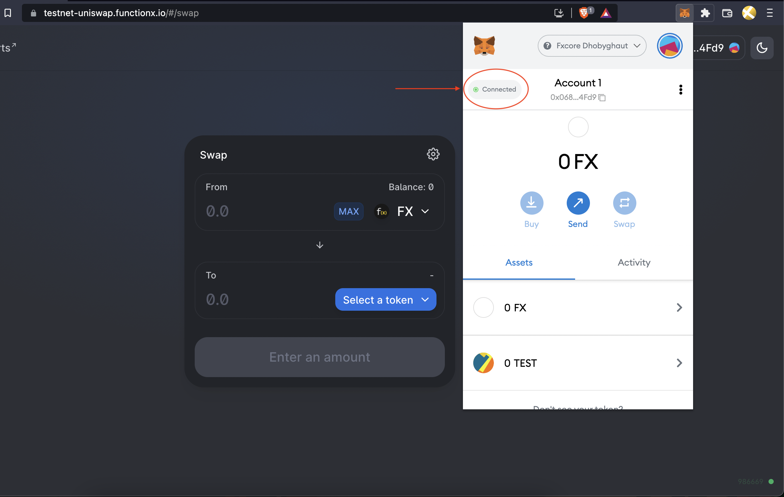

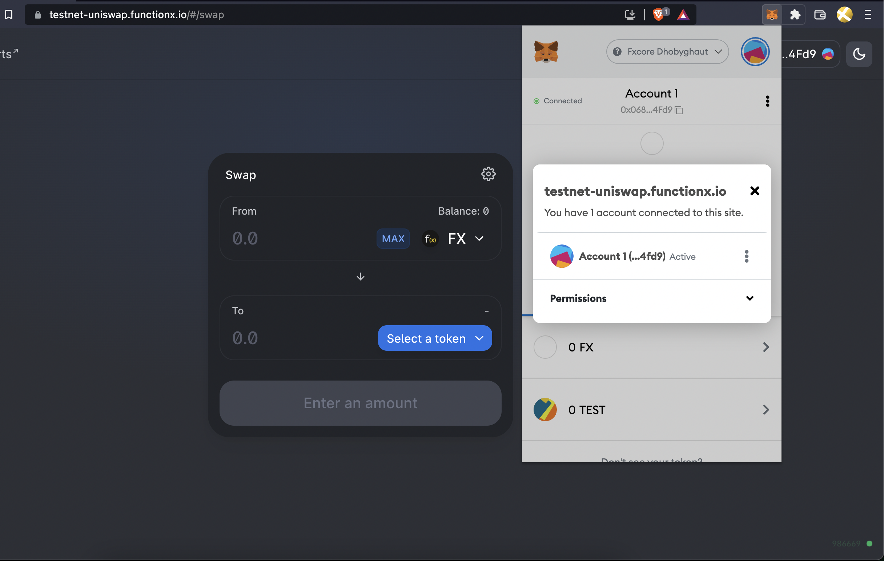

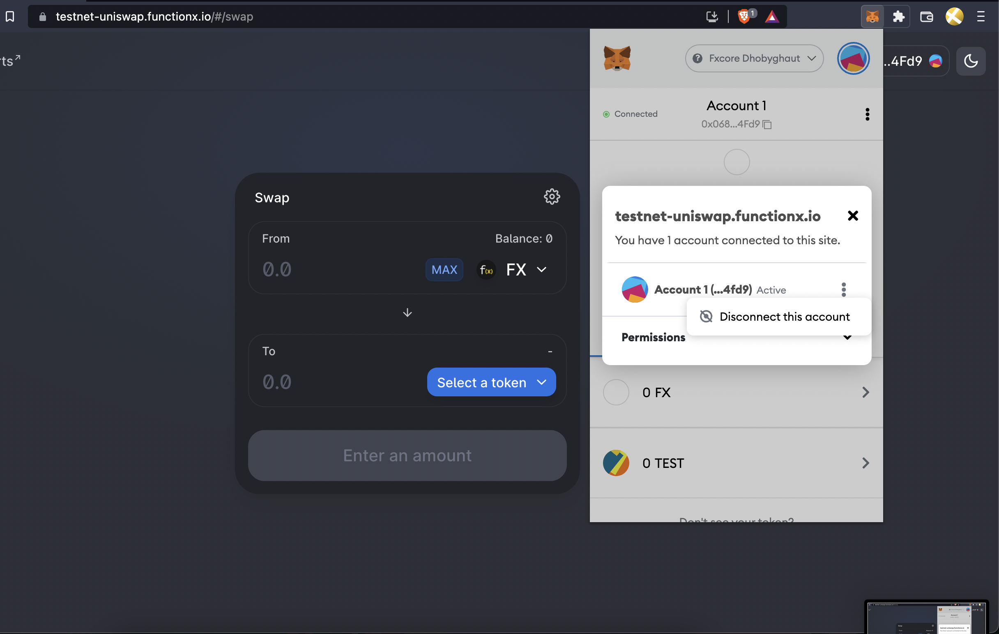

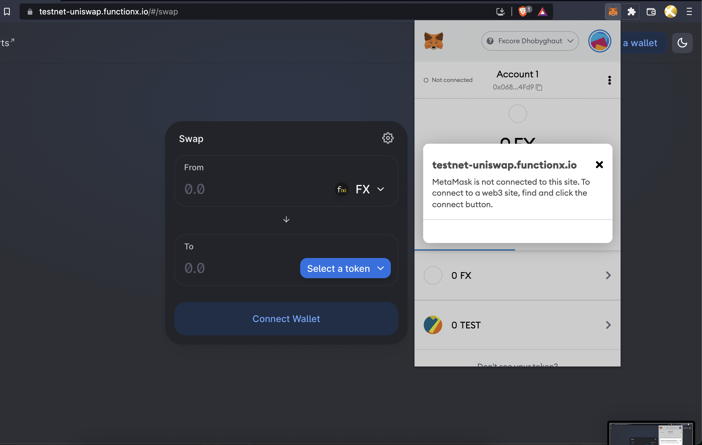

