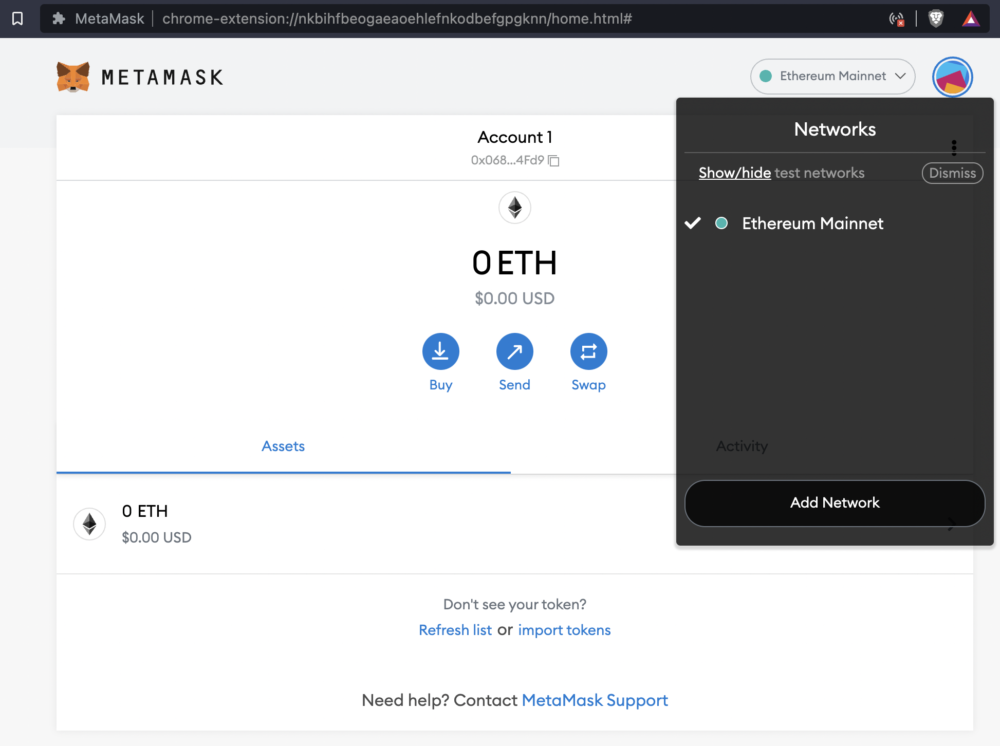
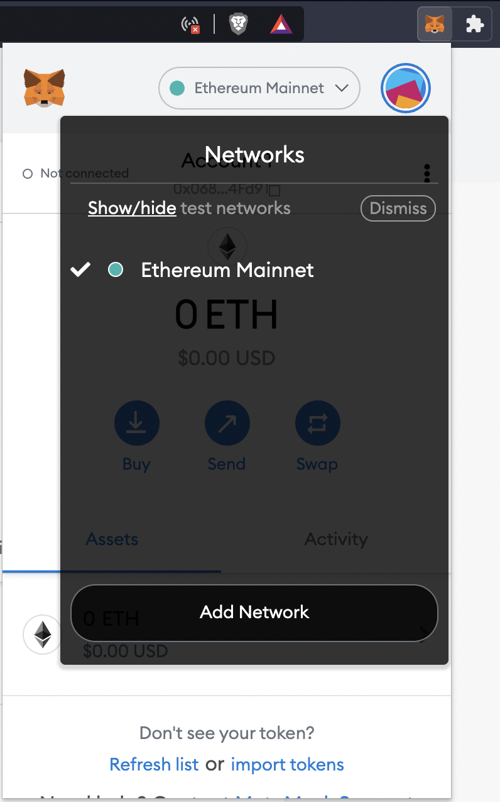
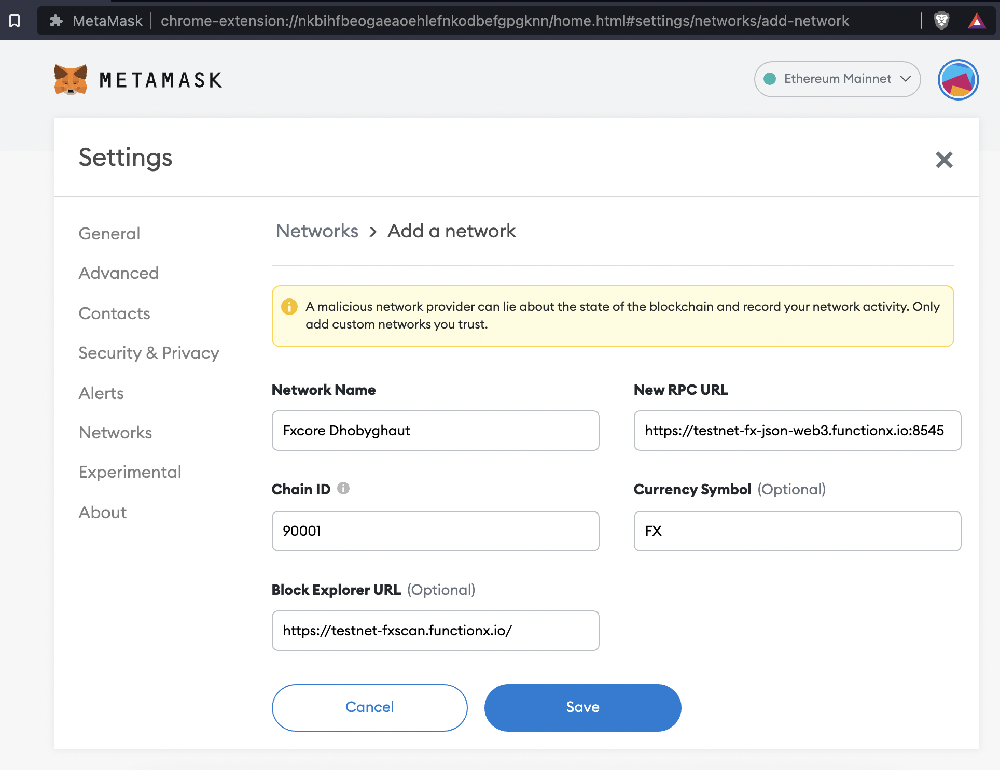
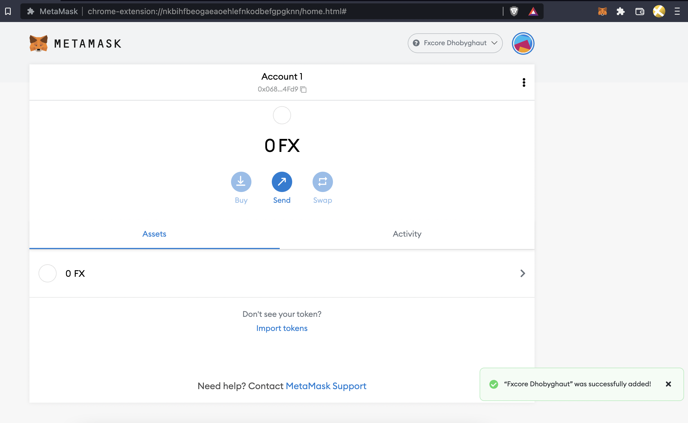

# Add f(x)Core Network

In order to interact with decentralised applications that have been built on the f(x)Core Network, you will need to add the network to MetaMask. At the time of writing, the only available network is the f(x)Core Testnet Network called Dhobyghaut.

****[**Get Test Tokens on Dhobyghaut-Testnet**](https://functionx.gitbook.io/home/resources/fxtestnetfaucet)



The EVM-Mainnet will be launched soon. Stay tuned! For now please add the Dhobyghaut-Testnet.



1. Click on the Network selection dropdown and then click on 'Add Network'
2. Fill in the fields as follow:

Network Name (it is up to you how you want to name it)

```
Fxcore Dhobyghaut
```

New RPC URL

```
https://testnet-fx-json-web3.functionx.io:8545
```

Chain ID

```
90001
```

Currency Symbol

```
FX
```

Block Explorer URL

```
https://testnet-fxscan.functionx.io/
```

&#x20;3\. Click 'Save'

You will be directly switched to f(x)Core's Dhobyghaut-Testnet now in the network dropdown list.

You have successfully added f(x)Core Dhobyghaut-Testnet Network to your MetaMask!

 






