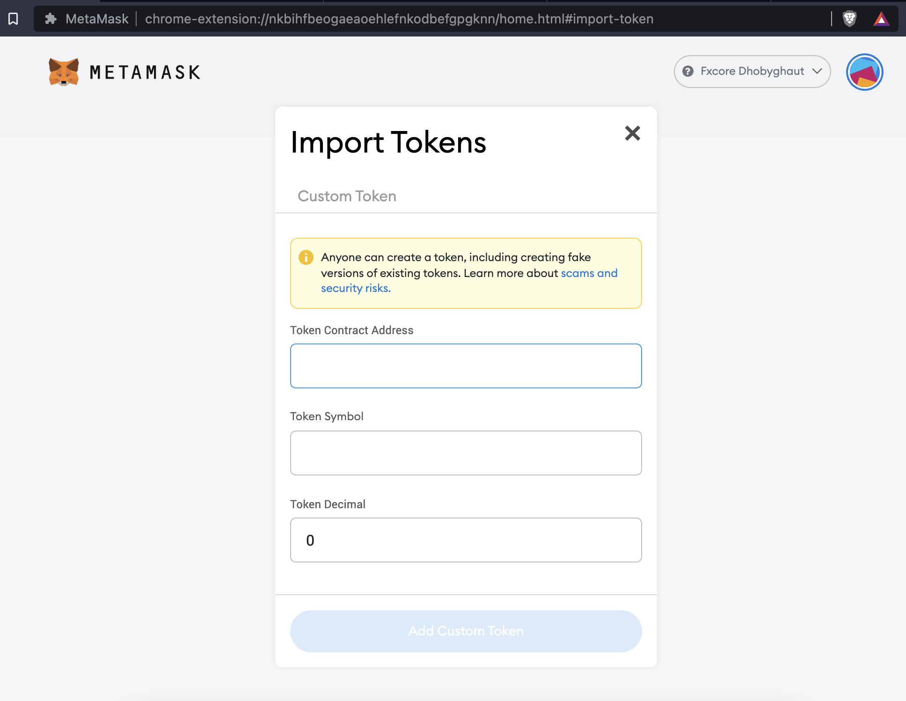
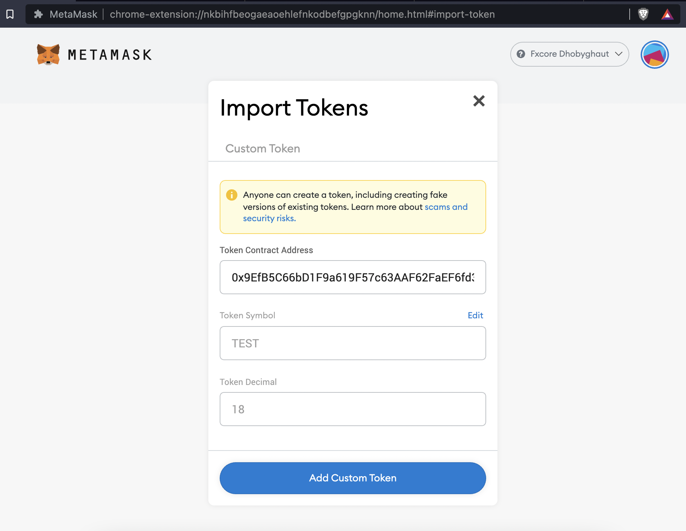
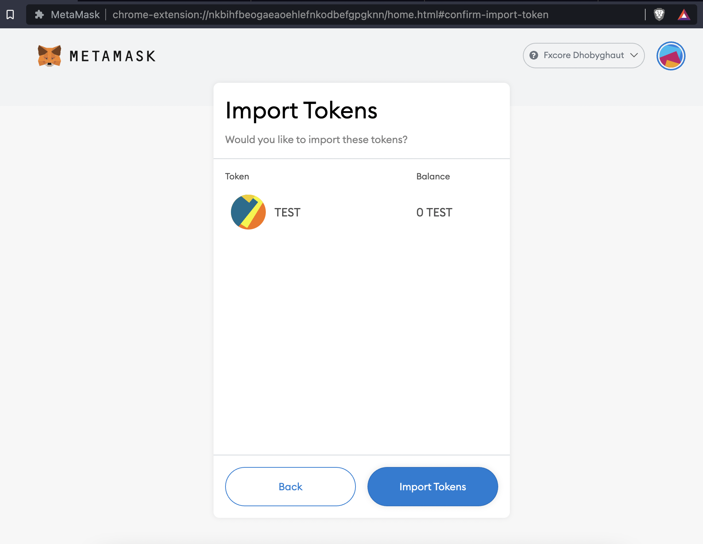
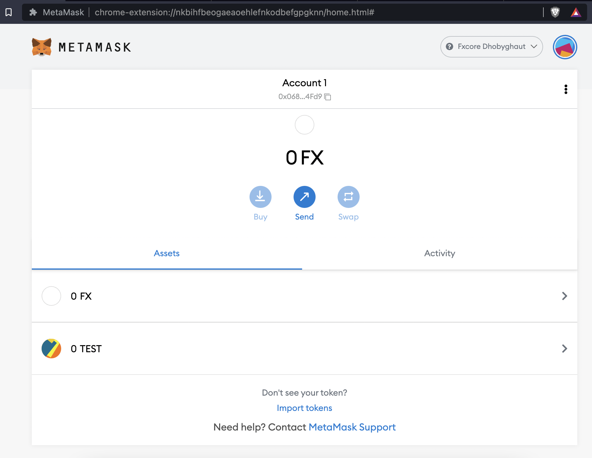

# Configure Custom Tokens

This page demonstrates the process of configuring/adding custom tokens to MetaMask. Tokens are created by deploying smart contracts (eg. ERC20 and ERC721), please refer to this [link](https://functionx.gitbook.io/home/deploying-on-f-x-core/with-remix) to learn the various methods of deploying smart contracts.

In this tutorial, we will be adding the `TEST` token (ERC20) to your MetaMask account on the f(x)Core Dhobyghaut-Testnet Network.

The `TEST` token contract address on the Dhobyghaut-Testnet is `0x9EfB5C66bD1F9a619F57c63AAF62FaEF6fd31C46`.

1. Click on 'Import Tokens'
2. Paste the token address into the form.
3. The token symbol and token decimal should automatically populate
4. Click 'Add Custom Token'
5. Click 'Import Tokens', if you already had some quantity of the token it will show up here
6. You will be navigated back to the home screen and the new token will be displayed in the token list

